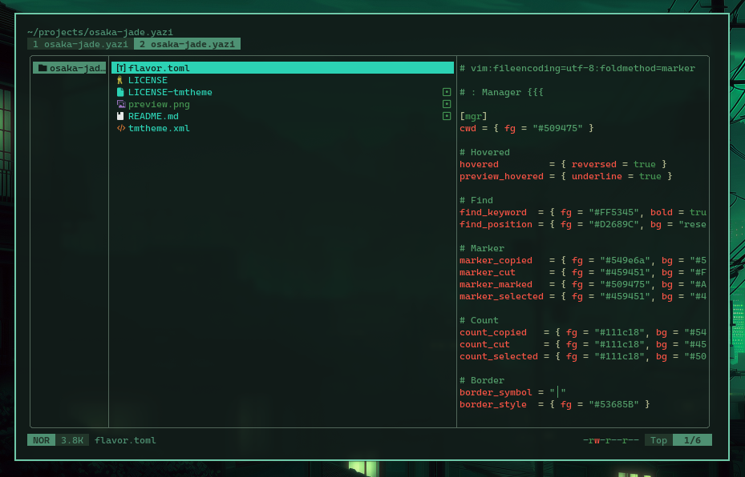

<div align="center">
  
</div>

<h3 align="center">
 Osaka Jade Flavor for <a href="https://github.com/sxyazi/yazi">Yazi</a>
</h3>

4. [ ] Modify the content and preview image in the README to fit your flavor.

## 👀 Preview



## 🎨 Installation

<!-- Please replace "username/example" with your repository name. -->

```sh
ya pkg add CharlesKellogg/osaka-jade
```

## ⚙️ Usage

To set it as your dark flavor, change the content of your `theme.toml` to:

```toml
[flavor]
dark = "osaka-jade"
```

Make sure your `theme.toml` doesn't contain anything other than `[flavor]`, unless you want to override certain styles of this flavor.

See the [Yazi flavor documentation](https://yazi-rs.github.io/docs/flavors/overview) for more details.

## 📜 License

The flavor is MIT-licensed<!--, and the included tmTheme is also MIT-licensed.-->

Check the [LICENSE](LICENSE)<!-- and [LICENSE-tmtheme](LICENSE-tmtheme)--> file for more details.
